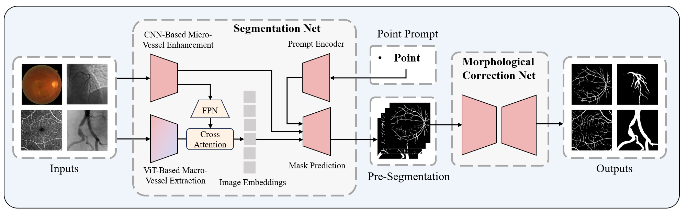

# Optimized Vessel Segmentation: A Structure-Agnostic Approach with Small Vessel Enhancement and Morphological Correction

## Dataset info

### Internal Validation Dataset

We use these dataset to train our model:

| Dataset            | Area                | Modality | Resolution | Split   | Access  | Related Link   |
|--------------------|---------------------|----------|------------|---------|---------|---------------------------------------------------|
| 134XCA        | Coronary Artery     | X-Ray    | 300×300    | 90/10/34  | Public |  http://personal.cimat.mx:8181/~ivan.cruz/DB_Angiograms.html|
| XCAD         | Coronary Artery     | X-Ray    | 512×512    | 75/9/42   | Public |  https://github.com/AISIGSJTU/SSVS|
| ARIA          | Retina              | Fundus   | 768×576    | 108/12/43  | Public | https://sourceforge.net/projects/aria-vessels/|
| CHASE_DB1    | Retina              | Fundus   | 960×999    | 18/2/8    | Public | https://blogs.kingston.ac.uk/retinal/chasedb1/|
| DR-HAGIS      | Retina              | Fundus   | 1024×1024  | 18/2/20   | Public | https://personalpages.manchester.ac.uk/staff/niall.p.mcloughlin/|
| DRIVE         | Retina              | Fundus   | 584×565    | 18/2/20   | Public | https://drive.grand-challenge.org/|
| FIVES         | Retina              | Fundus   | 2048×2048  | 540/60/200 | Public | https://www5.cs.fau.de/research/data/fundus-images/|
| Les-AV        | Retina              | Fundus   | 1620×1444  | 18/2/2    | Public | https://figshare.com/articles/dataset/LES-AV_dataset/11857698|
| ORVS         | Retina              | Fundus   | 1444×1444  | 38/4/7    | Public | https://github.com/AbdullahSarhan/ICPRVessels|
| STARE        | Retina              | Fundus   | 605×700    | 14/2/4    | Public | https://cecas.clemson.edu/~ahoover/stare/ |
| ROSE-1       | Retina              | OCTA     | 304×304    | 27/3/9    | Permission | https://imed.nimte.ac.cn/dataofrose.html |
| ROSSA        | Retina              | OCTA     | 320×320    | 736/82/100 | Public | https://github.com/nhjydywd/OCTA-FRNet |
| OCTA500-3M   | Retina              | OCTA     | 304×304    | 135/15/50  | Permission | https://ieee-dataport.org/open-access/octa-500 |
| OCTA500-6M   | Retina              | OCTA     | 400×400    | 180/20/100 | Permission | https://ieee-dataport.org/open-access/octa-500 |
| DrSAM        | Pelvic-Iliac Artery | X-Ray    | 386×448    | 360/40/100 | Public | https://drive.google.com/file/d/1TjxEJUD4VC_SAPcqdNVybsKRb_xW-Bze/view |

### External Validation Dataset

We use these dataset to evaluate the out-of-domain generalization of our model:

| Dataset            | Area                | Modality | Resolution | Access | Related Link   |
|--------------------|---------------------|----------|------------|---------|---------------------------------------------------|
| HRF        | Retina              | Fundus   | 3504×2336    | /15  | Public |  https://www5.cs.fau.de/research/data/fundus-images/|
| IOSTAR         | Retina              | Fundus    | 1024×1024    | 20/10   | Permission |  http://www.retinacheck.org/download-iostar-retinal-vessel-segmentation-dataset|
